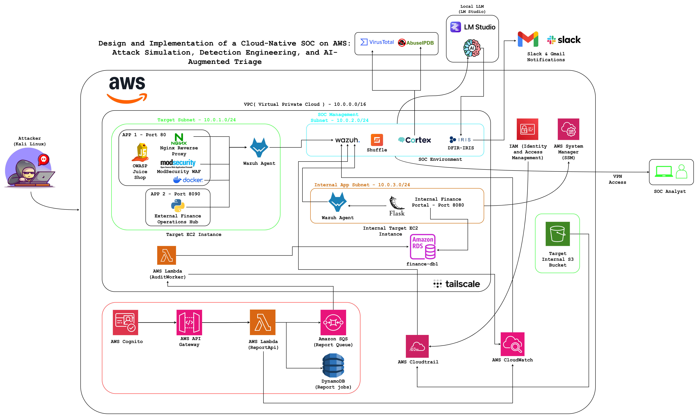
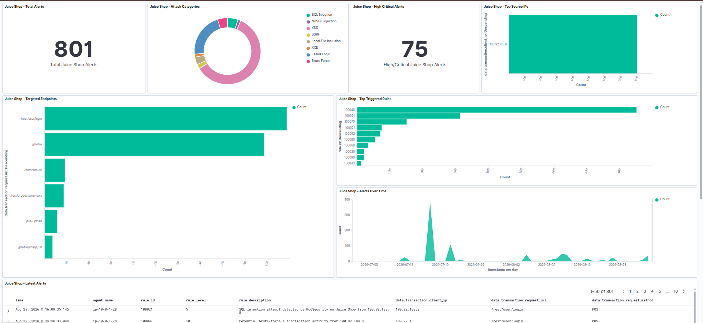
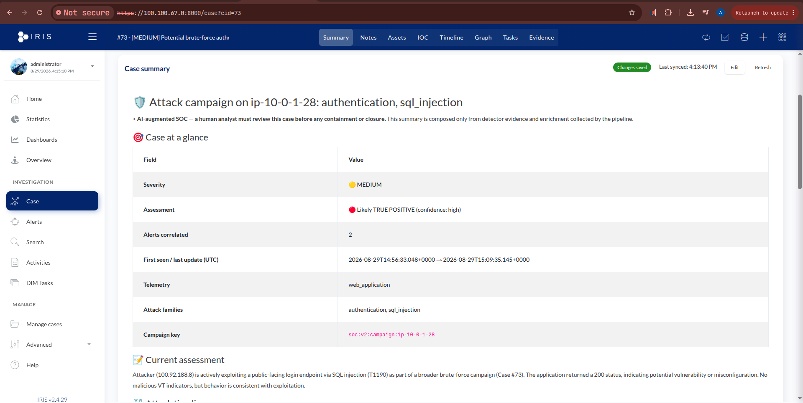

# Cloud-Native SOC on AWS — Purple Teaming, Detection Engineering & AI-Augmented Triage

> A two-month internship project at **Devoteam CyberTrust**: a small but realistic cloud-native
> Security Operations Center (SOC) lab built on AWS, exercised with a **purple-teaming** approach —
> realistic attacks are simulated across the cloud stack and, in the same motion, the detections
> that catch them are engineered.

The attack simulation and the detection engineering are the twin pillars of this work. On top of
them sits an **exploratory AI-augmented triage layer** that correlates alerts into human-ready
DFIR-IRIS cases — presented as a proof of concept and a direction for future work, not a finished
capability.

---

## The idea

In the cloud the single network perimeter multiplies into many **trust boundaries**, and the attacks
that matter most abuse *identity and trust* rather than breach a firewall. This lab makes that
concrete: a deliberately vulnerable AWS environment is attacked through four end-to-end scenarios,
and every attacker action is given a detection in **Wazuh**, decoding ModSecurity and AWS
CloudTrail/CloudWatch telemetry and mapping each rule to **MITRE ATT&CK**.

## Architecture



*The cloud-native SOC lab: a target subnet (Juice Shop + Nginx/ModSecurity WAF + Finance Ops Hub), a SOC subnet (Wazuh, Shuffle, Cortex, DFIR-IRIS, local LLM), an internal subnet (finance portal, RDS MySQL, DynamoDB, Secrets Manager), and a serverless path (API Gateway → Lambda → SQS → Lambda, Cognito) — all audited by CloudTrail/CloudWatch into Wazuh.*

Telemetry flow: **source → Wazuh agent / cloud wodle → decoder → rule → alert → (AI-augmented triage) → DFIR-IRIS → human analyst.**

## The four scenarios

| # | Scenario | Attack chain | Key ATT&CK |
|---|----------|--------------|------------|
| 1 | **Web attacks** (OWASP Juice Shop) | Brute force, SQLi, NoSQLi, LFI, SSRF, XSS, XXE | T1190, T1110, T1059 |
| 2 | **SSRF → cloud credential theft** | SSRF → IMDSv1 → steal EC2 role creds → read private S3 | T1552.005, T1078.004, T1530 |
| 3 | **Container escape → full cloud compromise** | SSTI → RCE → Docker socket abuse → host → IMDS theft → IAM privesc → SSM pivot → finance DB breach | T1611, T1552.005, T1098, T1078.004 |
| 4 | **Serverless confused-deputy** | Low-priv user → API Gateway/Cognito → Lambda deputy reads privileged data via role chaining | T1078.004, T1550 |

Each scenario provides an **attack runner**, the **vulnerable app / infrastructure**, a **walkthrough**,
and its **Wazuh detection rules** (see below).

## Repository layout

```
.
├── docs/                     Architecture, installation, images
├── infrastructure/
│   └── iam/                  IAM trust + least-privilege policy examples (JSON)
├── detection/                ← Detection engineering (pulled live from the Wazuh manager)
│   ├── decoders/             Custom JSON decoders (0006-json_decoders.xml, local_decoder.xml)
│   ├── rules/
│   │   ├── scenario1-web/    ModSecurity web-attack + brute-force correlation rules
│   │   ├── scenario2-ssrf-s3/
│   │   ├── scenario3-container-iam/
│   │   ├── scenario4-serverless/
│   │   └── cloud-cloudtrail/ Shared CloudTrail / S3 / IAM detections
│   └── ossec.conf.redacted.xml   Wazuh manager config (aws-s3 wodle, Shuffle integration) — secrets redacted
├── scenarios/                Attack runners, vulnerable apps, Lambda code, walkthroughs
│   ├── scenario1-web/
│   ├── scenario2-ssrf-s3/
│   ├── scenario3-container-iam/
│   └── scenario4-serverless/
└── ai-augmented-soc/                  ← Exploratory AI-augmented triage pipeline (Shuffle)
    ├── nodes/                20 Shuffle "Execute Python" nodes (00–16)
    └── guides/               REBUILD_WORKFLOW.md — one guide to rebuild the Shuffle workflow
```

## Detection engineering — the core

The heart of the project. A recurring lesson: in this Wazuh deployment the generic `json` decoder
matches by name but does **not** extract fields, so **every JSON source gets its own dedicated
decoder** in `detection/decoders/0006-json_decoders.xml` (ModSecurity, AWS CloudTrail, the Docker
listener, and the two custom finance apps). Rules then key on the decoded dot-notation fields and
carry MITRE ATT&CK metadata. Another hard-won lesson: CloudTrail writes **global-service events
(IAM, STS) to `us-east-1`** regardless of Region — the `aws-s3` wodle must include it.

See [`detection/README.md`](detection/README.md).

## AI-augmented triage (exploratory)

`ai-augmented-soc/` contains the Shuffle pipeline: **Wazuh → Shuffle → Cortex enrichment → local LLM → DFIR-IRIS → human**.
It correlates a multi-stage campaign into a single *living* IRIS case (entity-based correlation,
per-alert evidence, deterministic MITRE mapping) with a strict human-in-the-loop design. It is a
proof of concept — see [`ai-augmented-soc/README.md`](ai-augmented-soc/README.md) and the limitations noted there.

## ⚠️ Disclaimer

This is an **educational, deliberately-vulnerable lab** built in an isolated, now-decommissioned AWS
account. All credentials shown (e.g. `finance_admin` / `finance2026`) are **intentionally weak lab
values** used to demonstrate the attacks — never reuse them. Everything here is for **authorized,
defensive security research and training only.**

## Author

**Aymane Elouafi** — Cloud Security Engineering intern, Devoteam CyberTrust (2025/2026).
Academic supervisor: Prof. Hind Idrissi · Industry supervisor: Mr. Moncef Khafif.

## Screenshots

**The SOC dashboard and the AI-authored case — from raw alert storm to one explained case:**


*The Wazuh SOC dashboard for the Juice Shop host — hundreds of alerts, the volume the AI layer absorbs.*


*The AI-authored, colour-coded DFIR-IRIS case: severity/assessment badges, at-a-glance table, MITRE mapping.*

More screenshots (Shuffle workflow, Cortex, the local LLM, the attack runner, per-alert evidence, Slack/email
notifications) are in [`docs/images/`](docs/images/) and referenced from [`ai-augmented-soc/README.md`](ai-augmented-soc/README.md).
Attack architecture diagrams are in [`docs/images/architecture/`](docs/images/architecture/).
