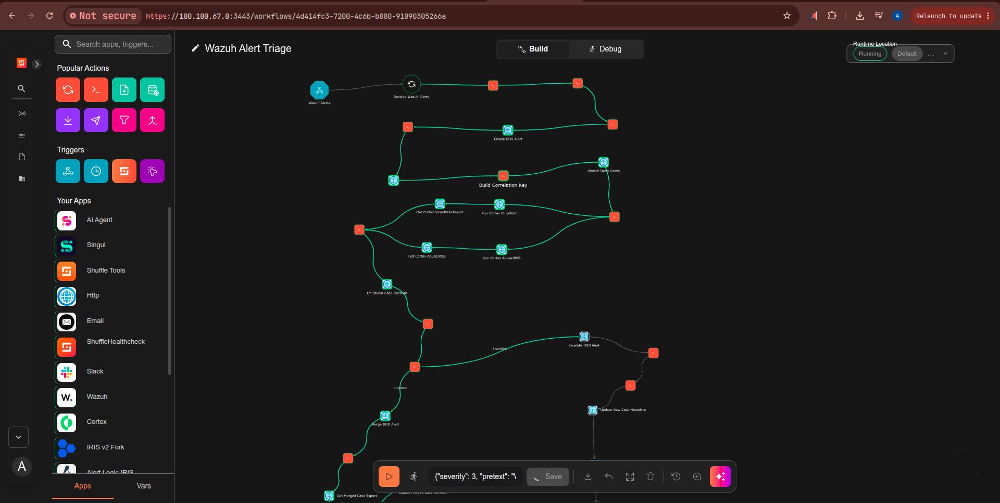
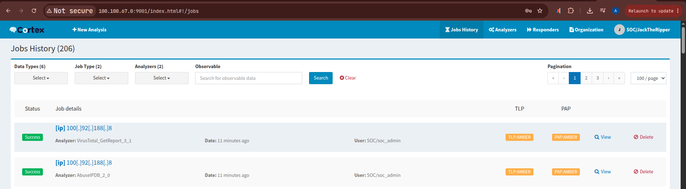
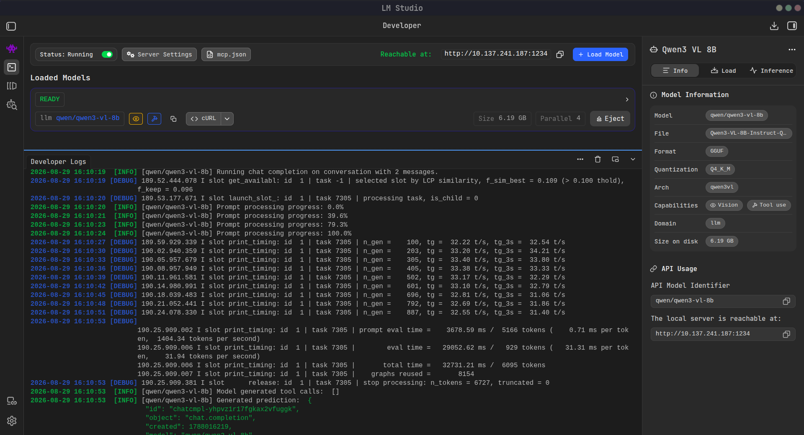
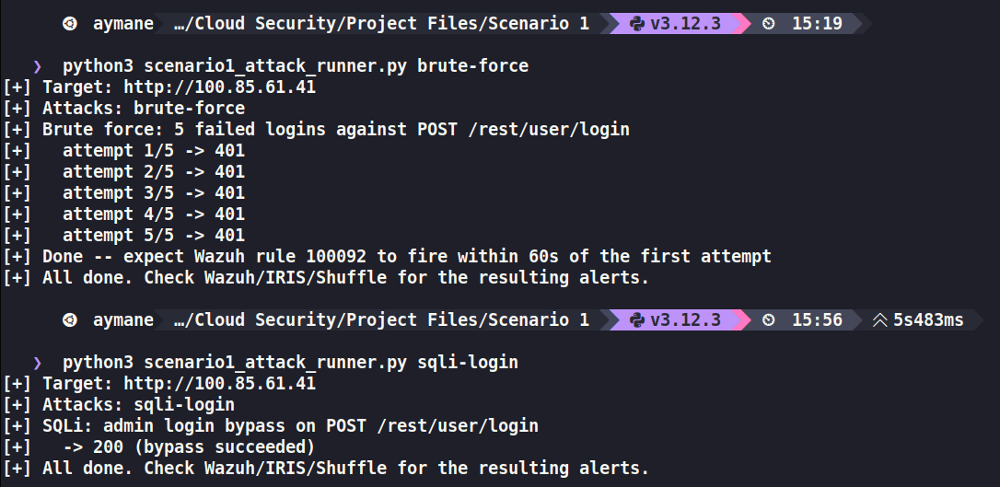
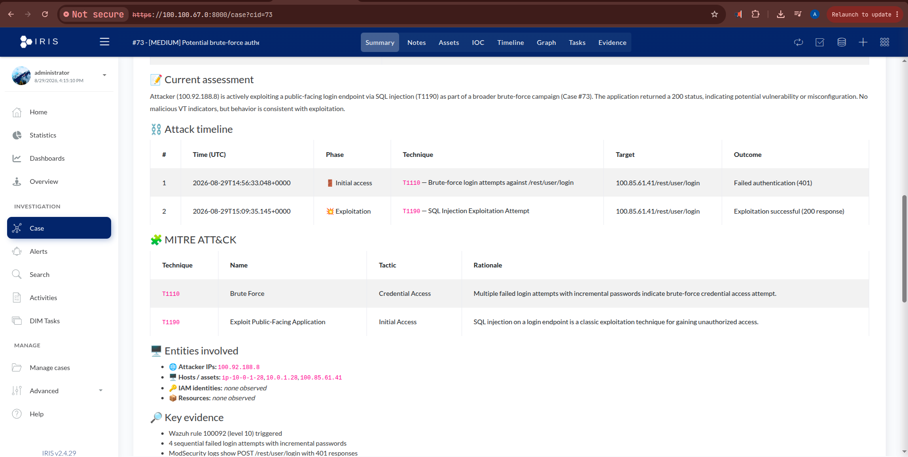
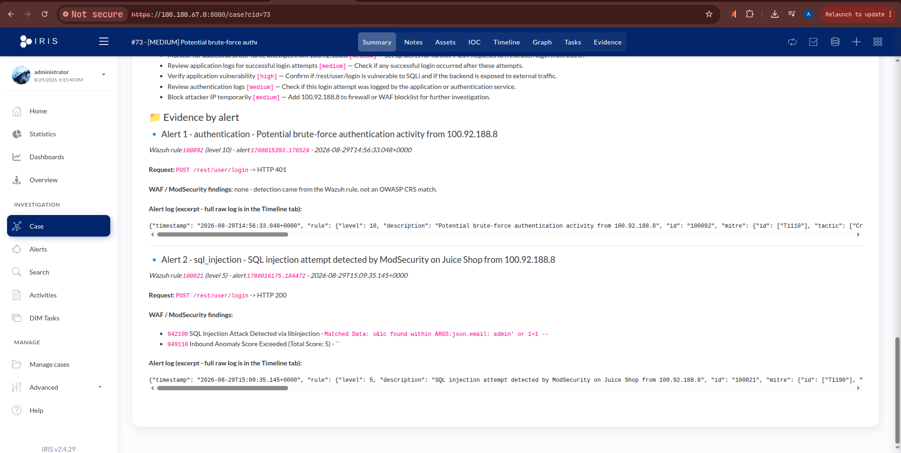
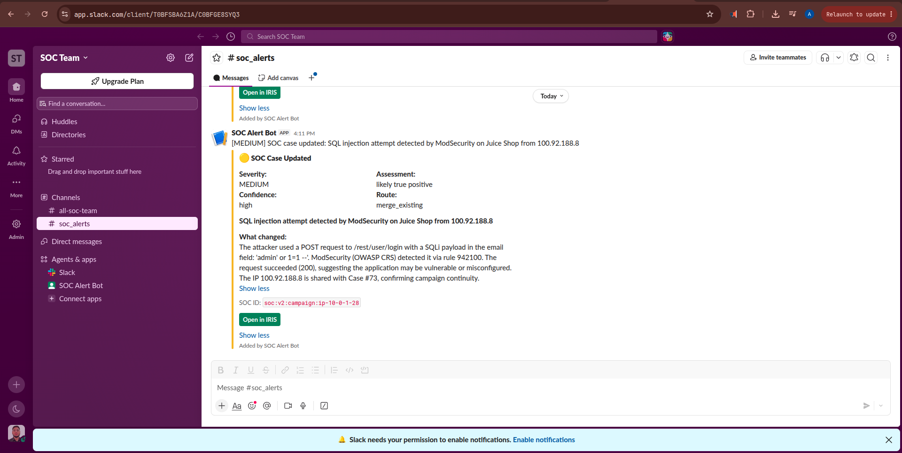
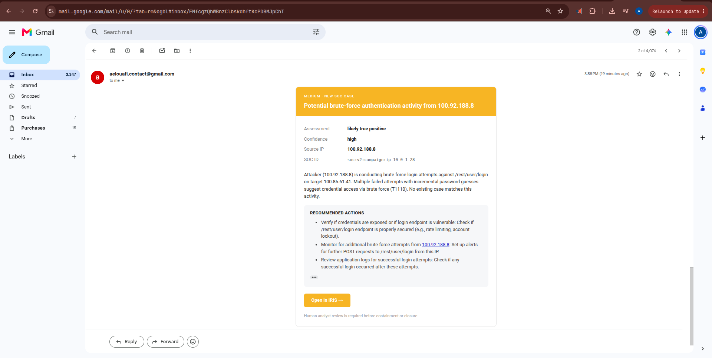

# AI-Augmented Triage Pipeline (exploratory)

A Shuffle SOAR workflow that turns raw Wazuh alerts into human-ready DFIR-IRIS cases:

```
Wazuh (soar_candidate) → Shuffle → Cortex (VirusTotal, AbuseIPDB) → local LLM → DFIR-IRIS → human analyst
```

`nodes/` holds the 20 Shuffle **Execute-Python** nodes (00–16); paste each into the matching node on
the Shuffle canvas. `guides/` has the full build and upgrade instructions:

- `BUILD_FROM_ZERO_FULL_WORKFLOW.md` — build the workflow from scratch.
- `IMPLEMENTATION_GUIDE.md` — node-by-node HTTP wiring.
- `UPGRADE_v2_GUIDE.md` — the v2 upgrade: entity/campaign correlation, living cases, per-alert evidence, deterministic MITRE.

## What it does
- **Entity-based correlation** groups a multi-stage campaign into one case (anchor + `ent:*` tokens as IRIS tags).
- **Living case**: on every merge the summary, timeline, MITRE, entities, evidence, and gaps are re-rendered; per-alert evidence is appended and never lost.
- **Grounded**: the prompt forbids asserting anything not in the evidence, MITRE IDs come from a curated table, and the case body is composed in code from validated fields.

## Design stance & limits
Human-in-the-loop, **non-autonomous** — it proposes; a person disposes; no containment is ever
automated. It is a **proof of concept**: the model is a general-purpose local LLM (no RAG, not trained
for SOC work), FP/TP could be a trained ML classifier, and it reasons only over the single alert — it
does not query Wazuh for surrounding events or investigate hosts (that would need an agentic system).
Secrets (IRIS API key, etc.) live only in the Shuffle HTTP nodes' Authorization headers — never in this code.

## Screenshots
| | |
|---|---|
|  | The Shuffle "Wazuh Alert Triage" workflow |
|  | Cortex running VirusTotal + AbuseIPDB enrichment |
|  | The local LLM (LM Studio, qwen3-vl-8b) serving triage |
|  | The Scenario 1 attack runner (brute force → SQLi) |
|  | The case attack timeline + MITRE ATT&CK table |
|  | Per-alert evidence, appended and never overwritten |
|  | Slack case notification |
|  | Email case notification |
